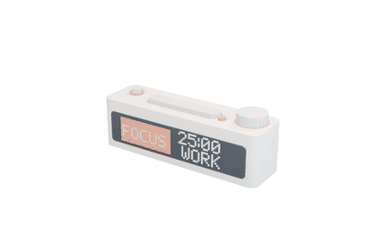

<div align="center">

<h1>Amagine3D</h1>

<p><strong>从硬件需求到可编辑的 3D 设计</strong></p>

<p>
  Amagine3D 是 <a href="https://amagine.ai">Amagine</a> 面向硬件创造开发的开源 3D 能力层。<br />
  输入产品描述和参考图，再补充关键尺寸，Amagine3D 就能围绕内部器件完成外壳和装配结构，并输出可继续编辑的源码。STEP、STL 和 3MF 可按任务导出。
</p>

<p>
  <a href="#capabilities">能力</a> ·
  <a href="#example">案例</a> ·
  <a href="#快速开始">快速开始</a> ·
  <a href="../README.md">English</a>
</p>

<p>
  
  
  
  
</p>

<p>
  
</p>

</div>

<a id="capabilities"></a>

## 从需求到可编辑的硬件结构

参数化 CAD 是 Amagine3D 已经落地的第一种 3D 能力。目前它聚焦智能硬件外壳及相关结构，可以从自然语言、参考图片和尺寸出发，建立完整的参数化设计。

设计会从内部元器件出发安排安装位和接口，再完成外壳、控制件与散热结构。需要分件时，盖体、铰链或卡扣会连同装配间隙和打印公差一起进入设计。对于铰链或滑盖这样的刚性结构，系统还可以沿设定的运动路径检查碰撞与运行间隙。

每次生成都会保留完整的 Python 与 build123d 源码。关键尺寸会出现在工作台中，可以直接调整并回写到源码，无需重新调用模型。单色设计可以导出 STEP 和 STL，多色设计可以生成带颜色信息的 3MF 与分区 STL。

在背后，3D-native Agent 会先把需求整理成设计简报，再把源码放入浏览器几何运行时真正构建模型。Agent 能看到模型的实际尺寸，也会收到关于零件连接、干涉和运动的检查结果。导出的模型文件同样会被重新读取。它根据这些结果决定继续修改，还是接受当前版本。

<a id="example"></a>

## 案例：BUSY Bar 桌面设备外壳

上方 GIF 展示的是 Amagine3D 参考 [BUSY Bar](https://busy.app/) 公开产品信息生成的一套桌面设备外壳。BUSY Bar 是一款用于显示自定义状态的效率多功能设备，内置番茄钟和应用，支持全面自定义、开源，并对开发者和硬件爱好者友好。Amagine3D 为它生成了可拆分外壳：正面留出显示区，顶部布置实体控制件，内部则按器件与接口安排空间。

Agent 先根据参考图确定显示区和控制件的位置，再围绕内部器件完成外壳分件。决定外观与装配的关键尺寸都保留为可编辑参数，可以在生成后继续调整。

这次生成产出了完整的 build123d 源码、STEP、STL 和检查报告。工作台可以继续预览、测量和修改模型；参数变化会写回源码并重新构建几何，整个结果也会随项目保存。

设计参考：[BUSY Bar 官方网站](https://busy.app/)。

<!--
更多案例素材进入仓库后，取消下面的注释。这里采用原始 Prompt 与对应 GIF 直接配对的方式，不再展开为完整案例。

## 更多生成结果

| Prompt | 结果 |
| --- | --- |
| [真实运行时的原始提示词] |  |
| [真实运行时的原始提示词] |  |
| [真实运行时的原始提示词] |  |
| [真实运行时的原始提示词] |  |
-->

## 3D-native Agent

Amagine3D 将 3D-native Agent 定义为一套以三维设计状态为核心的 Agent 架构。三维设计状态记录当前版本中各个零件的几何及其空间关系。Agent 的下一步动作由这个状态决定，执行结果也会写回其中。

```text
用户需求与物理约束
          │
          ▼
 已接受的 3D 设计状态
          │ 创建候选版本
          ▼
   ┌── 自主内环 ───────┐
   │ 读取模型 → 规划修改 │
   │    ↑          ↓    │
   │ 分析结果 ← 执行检查 │
   └────────┬───────────┘
            │ 检查通过
            ▼
     提交为新的设计版本
            │
            ▼
      保存状态并生成产物
```

在这套架构中，一次设计任务包含两个层级。自主内环负责产生候选设计，提交环节负责判断这个候选能否成为新的正式版本。两者分开运行，使 Agent 可以反复尝试，同时不破坏已经通过检查的设计。

自主内环的每一轮都从当前设计状态开始。Agent 先读取零件之间的空间关系，再决定需要修改的结构。修改后的模型会在真实几何环境中执行，系统直接测量生成结果，并检查装配干涉、运动路径和导出文件。检查结果会返回给 Agent。如果某项要求没有满足，Agent 会根据具体的测量值定位问题，修改受影响的部分，然后开始下一轮。这个过程使用的是实际生成的几何，而不是模型对结果的文字判断。

当候选设计满足当前任务的检查条件后，它才会进入提交环节。系统会把候选结果与用户约束和上一版设计进行比较。检查通过后，候选设计会被保存为新的基线，源码和制造文件也随之归档；如果修改引入了新的问题，系统会保留上一版结果，并让 Agent 继续修正。需要改变已确认结构或覆盖现有产物时，可以要求用户确认。

当前公开版本已经用参数化 CAD 实现了这套流程的第一阶段：Agent 根据设计简报生成 build123d 源码，在浏览器中构建几何，再依据检查结果修订或接受候选版本。目前，源码仍然是主要的设计状态，任务也按照预设阶段推进。下一阶段会把零件及其空间关系直接记录为持续更新的 3D 世界模型状态。届时，Agent 可以在这个状态上修改局部结构或切换几何表示，而不必每次都从对话和源码中重新理解整个设计。

## Beyond CAD

CAD 是 Amagine3D 的起点。完整的硬件创造还需要理解现实中的器件、空间关系和已有资产，让不同来源的 3D 信息在设计与制造之间持续流动。

下一阶段，Amagine3D 会逐步建立硬件项目的共同 3D 上下文。系统将知道一个模型代表屏幕、电池、PCB 还是连接器，理解它如何安装、需要避让什么、会影响哪些开孔和外壳尺寸，并在器件变化时更新相关结构。

3D 的入口也会从自然语言生成扩展到 mesh、图片、扫描和点云。精确结构可以继续使用参数化 CAD，外观形态可以来自生成式 mesh，现实物体可以通过三维重建进入项目；Agent 根据任务选择合适的表示，并让它们共享零件、尺度、位置和设计意图。

这套 3D 状态会继续延伸到制造。几何修复、壁厚、尺度、打印方向、支撑和制造文件不再是设计结束后的独立步骤，而会成为 Agent 推进硬件项目的一部分。

我们的目标，是让一个硬件构思可以从参考图、真实元器件和空间约束开始，在同一个 3D 设计过程中生长为能够装配和制造的产品。

## 快速开始

### 环境要求

- Node.js 20.19 或更新版本
- Python 3.10 至 3.13
- npm
- 现代桌面浏览器
- 兼容 Amagine3D Agent 运行时协议的模型网关

初始化脚本会在仓库内创建 `.venv`，并安装锁定版本的 build123d、
OCP、trimesh 和 lib3mf。宿主电脑不需要安装桌面 CAD 软件。

### 安装并运行

```bash
git clone https://github.com/amagine-ai/Amagine3D.git
cd Amagine3D
npm install
cp .env.example .env
npm run dev
```

配置 `.env` 后打开 `http://127.0.0.1:6160`。本地 API 默认监听
`http://127.0.0.1:6161`。首次启动会准备 `.venv`；依赖指纹没有变化时，
后续启动会直接复用。

### 服务端配置

```dotenv
LLM_API_KEY=...
LLM_MODEL=openai/gpt-5.5
LLM_BASE_URL=https://gateway.example.com/v1
LLM_API_TYPE=openai-responses
LLM_THINKING_LEVEL=medium
TAVILY_API_KEY=... # 可选；启用“联网参考”开关

PORT=6161
WEB_PORT=6160
AGENT_RUN_TIMEOUT_MS=1800000
```

这些值只由本地 Express 服务端读取。配置 `TAVILY_API_KEY` 后，输入区会显示
“联网参考”开关。为某轮开启后，Amagine3D Agent 必须先搜索再执行 CAD 写入或
构建；搜索会返回靠前的尺寸与规格来源，并尽力向多模态模型提供最多三张参考图。
缺少合适图片不会阻断原有 CAD Skill 流程。请勿通过客户端环境变量暴露 API
密钥，也不要提交 `.env`。

## 系统架构

`React/Vite 界面 -> Express API -> 3D-native Agent 运行时 -> 会话隔离的 Python CAD 工作区`

```text
Amagine3D/
├── src/
│   ├── components/cad-workbench/   对话、文件、预览、参数和存储面板
│   ├── components/CadViewer.tsx   Three.js 模型查看与交互
│   ├── lib/                       流式 API 客户端及产物、会话辅助逻辑
│   └── App.tsx, types.ts           应用外壳与前后端共用协议
├── server/
│   ├── routes/                    Agent 对话流与会话、产物 API
│   ├── artifacts*.ts, sessions.ts 产物发现、打包、回收与会话持久化
│   ├── uploads.ts, visual-audit.ts 图片输入与生成模型视觉检查
│   └── app.ts, index.ts             Express 启动、静态托管与运行时组装
├── packages/a3d-runtime/src/          3D-native Agent 模型/会话适配、Skill 加载与写入限制
├── skills/
│   ├── text-a3d/                  单色 CAD 生成与质量检查流程
│   └── text-a3d-color/            多色 CAD、配色、3MF 导出与质量检查流程
├── bundled-projects/                  工作台内置的只读示例项目
├── workspace/sessions/<sessionId>/   生成的源码、模型、报告和预览图
├── .amagine-state/                   Agent 会话、上传文件和本地运行状态
├── scripts/                           Python 环境安装与许可证检查
└── tests/                             服务端、运行时、产物与 UI 逻辑测试
```

每个 Agent 会话使用独立工作区。CAD 脚本由服务端管理的 Python 环境执行，浏览器通过 Three.js 渲染生成模型，模型凭据仅保留在服务端。更完整的设计见[威胁模型](./threat-model.zh-CN.md) 和 [安全上报](./SECURITY.zh-CN.md)。

## 项目状态

Amagine3D 正在持续迭代。当前公开版本聚焦智能硬件外壳的单色和多色参数化 CAD，完整工作流已在 Chrome 与 Edge 桌面浏览器中测试。

## 参与贡献

欢迎提交范围清楚的 issue 和 pull request。提交改动前请阅读 [CONTRIBUTING.zh-CN.md](./CONTRIBUTING.zh-CN.md)，并运行仓库检查：

```bash
npm run typecheck
npm test
npm run build
```

安全问题请按照 [SECURITY.zh-CN.md](./SECURITY.zh-CN.md) 中的私密流程上报。

## 核心依赖与致谢

Amagine3D 建立在以下开源项目之上：

| 项目                                                                                                      | 用途                   |
| --------------------------------------------------------------------------------------------------------- | ---------------------- |
| [build123d](https://github.com/gumyr/build123d)                                                            | 参数化 CAD 建模           |
| [Open CASCADE Technology](https://dev.opencascade.org/) 与 [CadQuery OCP](https://github.com/CadQuery/OCP) | 精确几何内核与 Python 绑定 |
| [Three.js](https://github.com/mrdoob/three.js)                                                             | 3D 预览、选择与测量       |
| [trimesh](https://github.com/mikedh/trimesh)                                                               | mesh 处理与检查           |
| [lib3mf](https://github.com/3MFConsortium/lib3mf)                                                          | 3MF 写入与回读            |
| [PI coding agent](https://github.com/earendil-works/pi)                                                    | Agent session、流式响应与工具调用 |

应用运行后可通过 `/licenses` 查看许可证页面。仓库内的许可证文本和生产 npm
依赖清单位于 [`public/licenses/`](../public/licenses/)。源码仓库的分发边界与
第三方署名说明见 [`THIRD_PARTY_NOTICES.md`](./THIRD_PARTY_NOTICES.md)。

## 许可证

Amagine3D 采用 [Apache License 2.0](../LICENSE)。

Copyright 2026 [amagine-ai](https://github.com/amagine-ai)。详见 [NOTICE](../NOTICE)。
